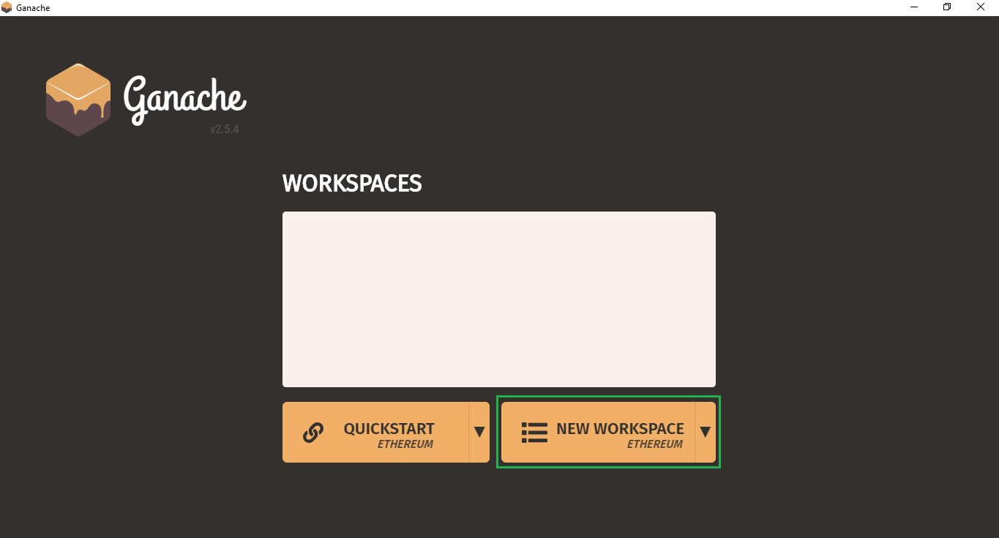
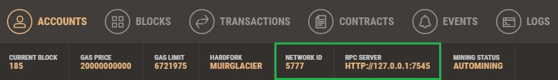
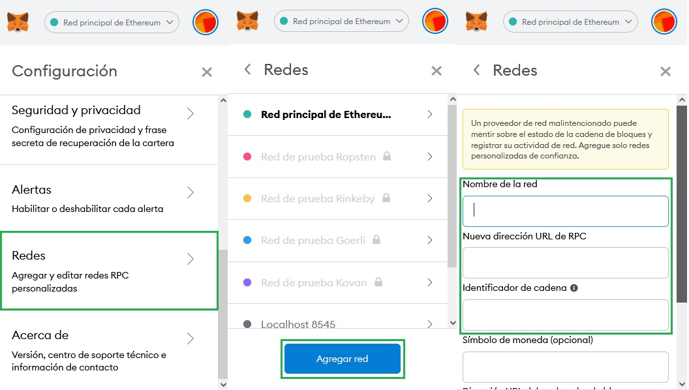
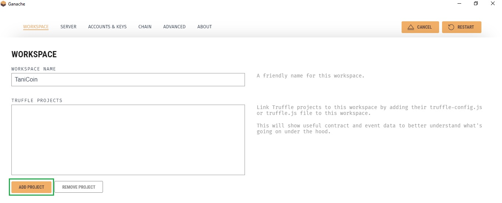
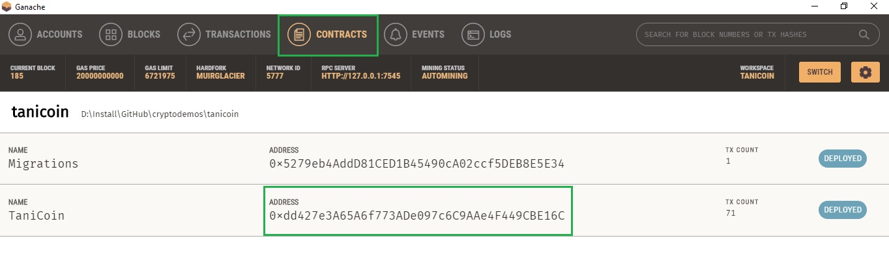
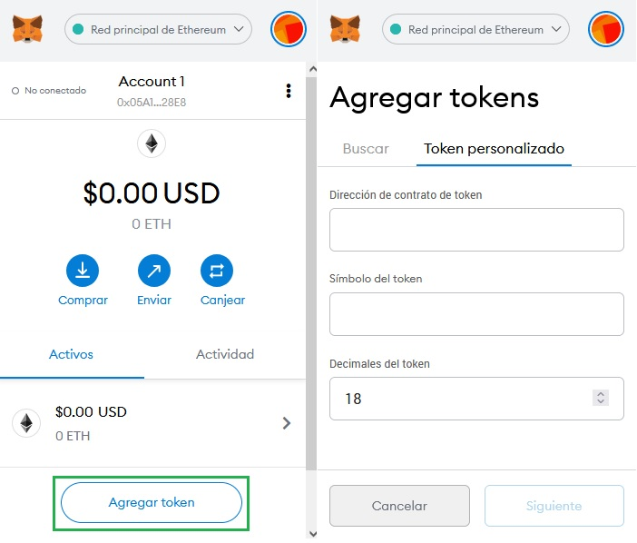
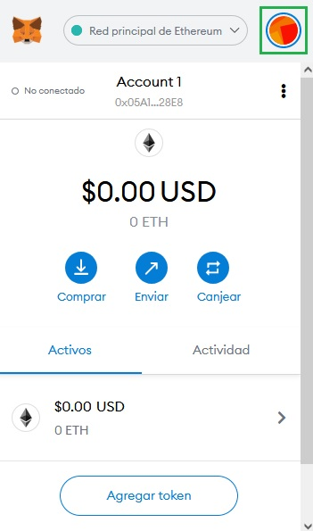

# Ejemplo de Truffle - Ganache

#### Es necesario tener instalado:

1- Node.js: https://nodejs.org/es/ \
2- Ganache: https://www.trufflesuite.com/ganache \
3- Truffle: https://www.trufflesuite.com/truffle

#### Pasos a seguir:

Iniciar una blockchain de prueba utilizando Ganache

Obtener una dirección de alguna de las cuentas de Ganache, 
excepto la 0 y la 1, sobreescribir la variable "profit_address"
en /contracts/TaniCoin.sol

##### Instalar dependencias:
        
        npm install
        
##### Compilar contratos:
        
        truffle compile

##### Desplegar contratos:

        truffle migrate
        
##### Ejecutar pruebas: 

        truffle test
        
#### App

##### Añadir red de prueba en MetaMask:

Es posible que al darle "Guardar", le diga que el puerto que esta usando Ganache 
es otro. Utilizar el que le dice.

Para obtener la dirección del token, he incluirlo como una nueva moneda en MetaMask,
primero debemos en la configuración de Ganache, añadir el proyecto, seria buscar 
dentro del repo el fichero "truffle-config.js".

Utilizando la llave privada de cada cuenta, añadiremos a MetaMask
las 3 cuentas a usar.

Index 0 - Cuenta que por defecto tendrá todos los tokens TaniCoin. \
Index 1 - Cuenta a la que vamos a transferir X cantidad de TaniCoin. \
Index 9 - Cuenta que almacenará las ganacias obtenidas por cada transacción.

dejando seleccionada al terminar, la cuenta del Index 0 para poder ejecutar la 
primera transferencia.

##### Instalar dependencias:
    
    npm install

##### Compila y recarga en caliente para el desarrollo:

    npm run serve

##### Compila y minimiza para producción:

    npm run build

