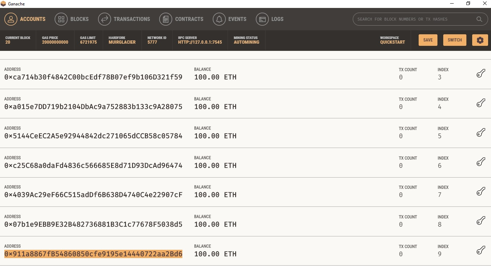

# Ejemplo de Truffle - Ganache

##### Es necesario tener instalado:

1- Node.js: https://nodejs.org/es/ \
2- Ganache: https://www.trufflesuite.com/ganache \
3- Truffle: https://www.trufflesuite.com/truffle

##### Pasos a seguir:

Iniciar una blockchain de prueba utilizando Ganache

Obtener una dirección de alguna de las cuentas de Ganache, 
excepto la 0 y la 1, sobreescribir la variable "profit_address"
en /contracts/TaniCoin.sol

Instalar dependencias:
        
        npm install
        
Compilar contratos:
        
        truffle compile

Desplegar contratos:

        truffle migrate
        
Ejecutar pruebas: 

        truffle test
        
##### App

Instalar dependencias:
    
    npm install

Compila y recarga en caliente para el desarrollo:

    npm run serve

Compila y minimiza para producción:

    npm run build

